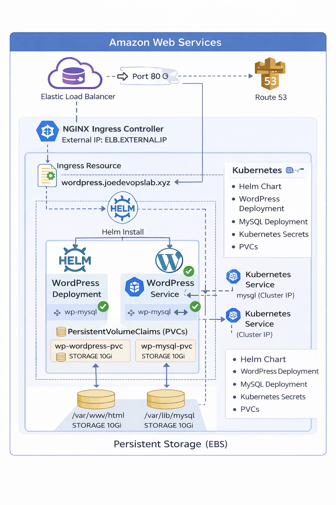

# WordPress on Kubernetes using Helm & NGINX Ingress

This project demonstrates deploying a production-ready WordPress application
on a Kubernetes cluster using Helm charts and NGINX Ingress Controller.

The setup includes:
- WordPress application
- MySQL database
- Persistent storage using PVCs
- NGINX Ingress Controller
- Custom domain routing via AWS Load Balancer

---

## 🛠️ Technology Stack

- Kubernetes
- Helm 3
- NGINX Ingress Controller
- WordPress
- MySQL
- AWS (EC2, ELB, Route53 / External DNS)
- Linux (Ubuntu)

---

## 📐 Architecture Overview



---

## 📂 Repository Structure

```
wordpress-k8s-helm-nginx/
│
├── helm-charts/
│   └── wordpress/
│       ├── README.md
│       ├── Chart.yaml
│       ├── values.yaml
│       └── templates/
│           ├── _helpers.tpl
│           ├── mysql-deployment.yaml
│           ├── mysql-pvc.yaml
│           ├── mysql-service.yaml
│           ├── wordpress-deployment.yaml
│           ├── wordpress-pvc.yaml
│           ├── wordpress-service.yaml
│           ├── wordpress-ingress.yaml
│           ├── wordpress-secret.yaml
│           └── NOTES.txt
│
├── infrastructure/
│   └── nginx-ingress/
│       ├── README.md
│       └── install.sh   
│ 
├── screenshots/
│   ├── ingress-details.png
│   ├── wordpress-login.png
│   └── wordpress-home.png
│
├── architecture/
│   └── wordpress-k8s-architecture.png
│
├── .gitignore
└── README.md
```

---

## 🚀 Deployment Steps

1. Deploy NGINX Ingress Controller
```
kubectl apply -f https://raw.githubusercontent.com/kubernetes/ingress-nginx/controller-v1.1.3/deploy/static/provider/aws/deploy.yaml

```
2. Install WordPress using Helm
```
helm install wp helm-charts/wordpress -n wp-ns --create-namespace
```
3. Verify Resources
```
kubectl get all -n wp-ns
kubectl get ingress -n wp-ns
```
🌐 Access Application
```
http://wordpress.joedevopslab.xyz
```

Admin:
```
http://wordpress.joedevopslab.xyz/wp-admin
```

---

## 📸 Screenshots
```
| Description     | Image                               |
| --------------- | ----------------------------------- |
| Ingress Details | screenshots/ingress-details.png     |
| WordPress Home  | screenshots/wordpress-home.png      |
| Login Page      | screenshots/wordpress-login.png     |

```

---

## 🔒 Security Considerations

- Credentials stored as Kubernetes Secrets

- External access controlled via Ingress

- Can be extended with TLS using cert-manager

---

## 🧠 Use Cases

1️⃣ Real-World Application Deployment

- Deploys a stateful production-like WordPress application using Kubernetes primitives.

2️⃣ Helm Chart Authoring

- Parameterized deployments using values.yaml

- Reusable Helm templates

- Secrets management via Kubernetes Secrets

3️⃣ Kubernetes Ingress & Load Balancing

- NGINX Ingress Controller

- AWS ELB integration

- Host-based routing using custom domain

4️⃣ Persistent Storage Management

- PVCs for WordPress content and MySQL data

- Demonstrates stateful workloads in Kubernetes

5️⃣ Cloud-Native DevOps Skills

- AWS infrastructure awareness

- DNS mapping

- Production troubleshooting (helm lint, ingress debugging)

---

## 🔄 Future Enhancements

- HTTPS with cert-manager & Let’s Encrypt

- CI/CD using GitHub Actions

- Horizontal Pod Autoscaler

- External MySQL (RDS)

- Monitoring with Prometheus & Grafana

